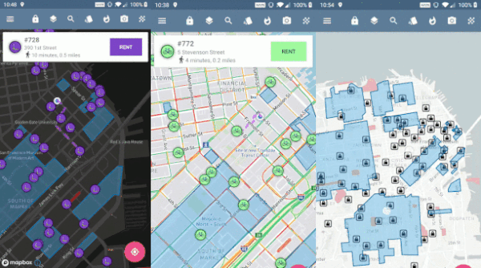

**Mapbox YOLP**では旧YOLPデベロッパーをMapboxへの移行をサポートしています。

## 🚩このレポジトリの目的

このレポジトリでは日本語の技術的なサポートを提供しています。

- 技術的な質問がある場合で日本語で希望の場合は[ここから](https://github.com/mapbox/mapbox-YOLP/issues)issueをあげて下さい。
- 個人情報を含む請求やのアカウントに関わる質問はjapan@mapbox.comにお問い合わせください。
- 詳しい値段に関しても質問はjapan@mapbox.comにお問い合わせください。
- エンタープライズ向けの資料請求に関しましては、japan@mapbox.comにお問い合わせください。
- 上記の項目に当てはまらない場合はjapan@mapbox.comにお問い合わせください。

### 🆓 Mapboxは無料ですか

無料利用枠内であれば無償で使えます。[詳しくは](https://www.mapbox.com/pricing/)をご覧ください。

### 🏁 どこから始めたら良いかわからない場合

スタートポイントとしてはこれらのリンクを参照してください。

- [Mapbox Studio](https://docs.mapbox.com/studio-manual/overview/)
- [チュートリアルのまとめ](https://docs.mapbox.com/jp/help/tutorials/)
- [GL JSの例のまとめ](https://docs.mapbox.com/jp/mapbox-gl-js/examples/)
- [Android SDKの例のまとめ](https://docs.mapbox.com/jp/android/maps/examples/)
- [iOS SDKの例のまとめ](https://docs.mapbox.com/ios/maps/examples/)

##  👨‍💻技術サポートに関して

### YOLPの仕様に関して質問があります

こちらではMapboxの導入サポートを実施していますのでYOLPの仕様に関しましてはjapan@mapbox.comにお問い合わせください。

### ✅ サポート返答保証は存在しますか

サポートチームとしては、このレポジトリーのissueや他のMapboxのレポジトリのissueなどに対して迅速に対応する考えを持っています。issueの量や体制により返事が遅れる場合がありまして、返答期間に対しましては保証がありませんのでご了承ください。又、有償のサポートをお求めの場合は[サポートプランをご覧になって下さい](https://www.mapbox.com/pricing/#support-pricing)。

**The purpose of this repository**

**In this repository, we support the YOLP developers migrating to Mapbox.**

**How to get started**

As a starting point, please refer to the links below

- [Mapbox Studio](https://docs.mapbox.com/studio-manual/overview/)
- [A collection of tutorials](https://docs.mapbox.com/jp/help/tutorials/)
- [A collection of GL JS examples](https://docs.mapbox.com/jp/mapbox-gl-js/examples/)
- [A collection of Android SDK examples](https://docs.mapbox.com/jp/android/maps/examples/)
- [A collection of iOS SDK examples](https://docs.mapbox.com/ios/maps/examples/)

- If you have any technical questions, please create a ticket [here](https://github.com/mapbox/mapbox-YOLP/issues)
- If the question involves private information that includes billing or account information, please email japan@mapbox.com.
- If you would like to request information about Enterprise accounts, please contact *email address*
- If any of the above does not match what you are looking for, please email japan@mapbox.com.

**Is Mapbox free?**

We have a free tier. However, some use cases or volume may require payment. For details, please look at the [pricing page](https://www.mapbox.com/pricing).

**Regarding technical support:**

**I have a question about YOLP.**

We don't provide direct support for YOLP here. For YOLP support, please contact japan@mapbox.com.

**Is there a guaranteed response time?**

We will do all we can to answer questions as soon as possible. However, we do not guarantee a response time for issues opened in this or any other Mapbox repository. We also do not guarantee a response time for questions submitted to the support page directly.

If you need a guaranteed response time, we offer premium support packages that come with a response time to meet your needs. For more info, see the support [pricing page](https://www.mapbox.com/pricing/#support-pricing).
